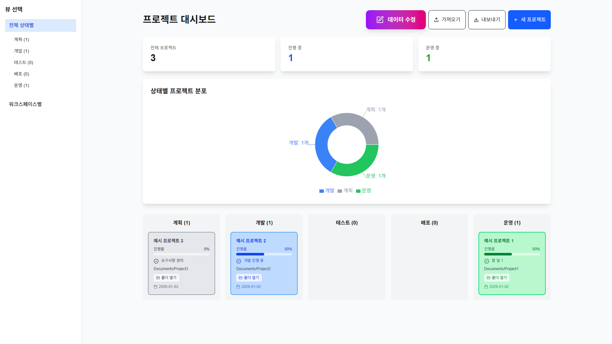
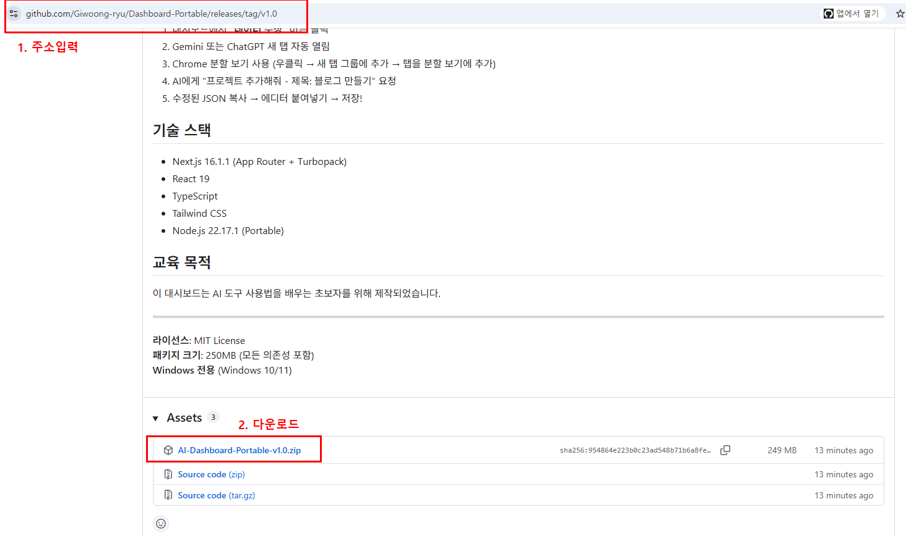
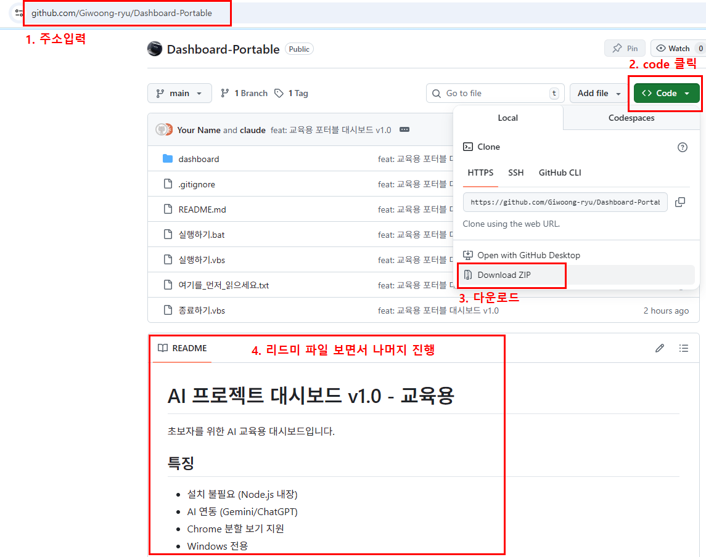
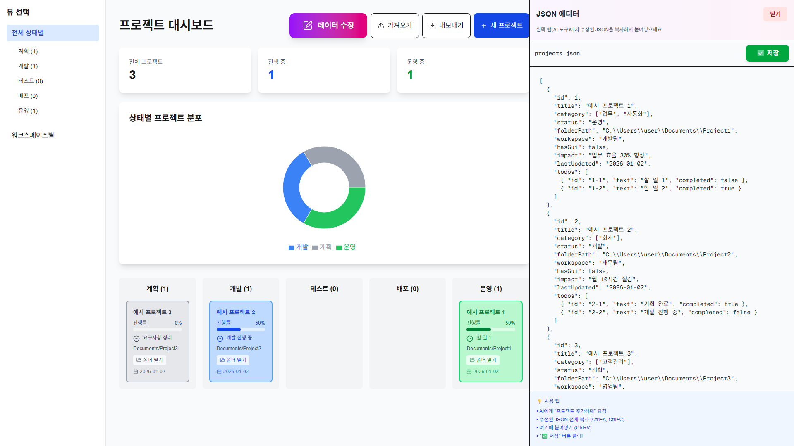

# AI 프로젝트 대시보드 v1.0 - 교육용

초보자를 위한 AI 교육용 대시보드입니다.

## 특징

- 설치 불필요 (Node.js 내장)
- AI 연동 (Gemini/ChatGPT)
- Chrome 분할 보기 지원
- Windows 전용

## 다운로드

### 방법 1: Release에서 다운로드 (권장) ⭐

**바로 실행 가능한 포터블 버전**

1. [Releases 페이지](https://github.com/Giwoong-ryu/Dashboard-Portable/releases) 접속
2. 최신 버전의 `AI-Dashboard-Portable-v1.0-final.zip` 다운로드 (182MB)
3. 압축 해제 후 `실행하기` 더블클릭!

> ✅ 설치 없이 바로 실행됩니다 (Node.js 포함)

### 방법 2: Code 버튼에서 다운로드 (개발자용)

1. 위 스크린샷 참고
2. Code 버튼 → Download ZIP
3. 압축 해제 → `npm install` → `npm run build` 필요

> ⚠️ 개발 환경 구축이 필요합니다 (Node.js 설치 필수)

## 사용 방법

1. ZIP 파일 다운로드
2. 압축 해제
3. **`실행하기`** 더블클릭 (VBS 파일)
4. 브라우저 자동 열림
5. 끝!

> 💡 **첫 실행 시**
> - 필요한 패키지 자동 설치 (1-2분, 단 1회만)
> - 이후 실행은 즉시 시작됩니다

## AI로 데이터 수정하기

1. 대시보드에서 **"데이터 수정"** 버튼 클릭
2. Gemini 또는 ChatGPT 새 탭 자동 열림
3. Chrome 분할 보기 사용 (우클릭 → 새 탭 그룹에 추가 → 탭을 분할 보기에 추가)
4. AI에게 "프로젝트 추가해줘 - 제목: 블로그 만들기" 요청
5. 수정된 JSON 복사 → 에디터 붙여넣기 → 저장!

## 기술 스택

- Next.js 16.1.1 (App Router + Turbopack)
- React 19
- TypeScript
- Tailwind CSS
- Node.js 22.17.1 (Portable)

## 라이선스

MIT License

## 교육 목적

이 대시보드는 AI 도구 사용법을 배우는 초보자를 위해 제작되었습니다.
